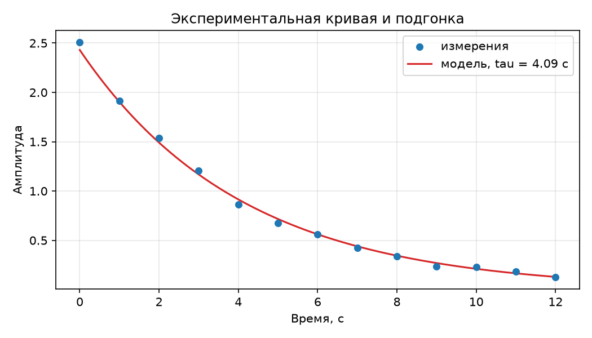

# Эксперимент: воспроизводимый конвейер «данные → результат → сайт»

Страница полностью генерируется конвейером: скрипт `scripts/run_experiment.py` читает
набор данных `data/experiment.csv`, выполняет подгонку модели затухания
$A e^{-t/\tau}$, строит графики и выгружает результаты в `docs/_data/`, откуда они
подставляются на страницу при сборке MkDocs (плагин `mkdocs-macros`).

## Метка версии сборки

| Параметр | Значение |
|---|---|
| Коммит | `{{ build_info.commit }}` |
| Дата сборки | {{ build_info.build_date }} |
| Версия набора данных (SHA-256) | `{{ build_info.dataset_version }}` |
| Файл данных | `{{ build_info.dataset_file }}` |

## Результаты подгонки

<div class="fresh-box" markdown="1" data-changed-at="{{ pipeline.data_changed_at if pipeline.data_changed_at is not none else '' }}">

| Параметр | Значение |
|---|---|
| Начальная амплитуда $A$ | {{ experiment.A }} |
| Постоянная затухания $\tau$, с | {{ experiment.tau }} |
| $R^2$ (в лог-шкале) | {{ experiment.r2 }} |
| σ остатков (лог-шкала) | {{ experiment.residual_std }} |
| Точек в выборке | {{ experiment.n_points }} |

</div>

## Измеренные данные

<div class="fresh-box" markdown="1" data-changed-at="{{ pipeline.data_changed_at if pipeline.data_changed_at is not none else '' }}">

| $t$, с | Амплитуда |
|---:|---:|
| {{ p.t }} | {{ p.amplitude }} |


</div>

## Статический график

<figure>
  
  <figcaption>Рисунок 1. Данные из experiment.csv и модель $A e^{-t/\tau}$ (matplotlib, построен при сборке)</figcaption>
</figure>

## Интерактивный график

<iframe src="images/exp-plotly.html" width="100%" height="460" style="border:none;" loading="lazy"></iframe>

## Кэширование конвейера

Скрипт сохраняет результаты в `.build/experiment/` вместе с манифестом
(хеш данных + хеш скрипта). Если ни данные, ни код не менялись, пересчёт
пропускается, а готовые артефакты копируются из кэша.

Таблицы выше подсвечиваются зелёным, если данные `experiment.csv` были изменены
менее минуты назад; подсветка плавно гаснет к обычному виду в течение минуты.

| Сценарий | Время, с |
|---|---:|
| Пересчёт (данные или скрипт изменены) | {{ pipeline.fresh_seconds }} |
| Из кэша (без изменений) | {{ pipeline.cached_seconds if pipeline.cached_seconds is not none else '—' }} |

Выигрыш: {{ pipeline.saved_percent if pipeline.saved_percent is not none else '—' }}%. Замеры соответствуют последнему запуску
на локальной машине; при сборке в CI кэш `.build/` недоступен и всегда выполняется
пересчёт.

## Демонстрация «изменение данных → обновление сайта»

1. В `data/experiment.csv` изменяются значения (или добавляются новые строки).
2. Изменение отправляется в основную ветку (`git commit` + `git push`).
3. Workflow `Deploy MkDocs` запускается автоматически: на стадии `Build site`
   сначала выполняется `scripts/run_experiment.py`, затем `mkdocs build --strict`.
4. На этой странице обновляются: версия набора данных в метке сборки, таблица
   измерений, параметры подгонки и оба графика.

Метку версии набора данных на этой странице можно сверить с хешем файла:

```bash
shasum -a 256 data/experiment.csv
```
