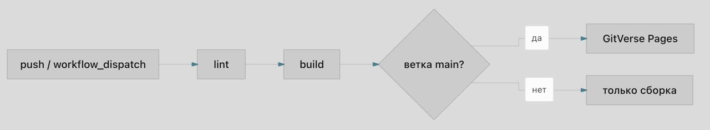
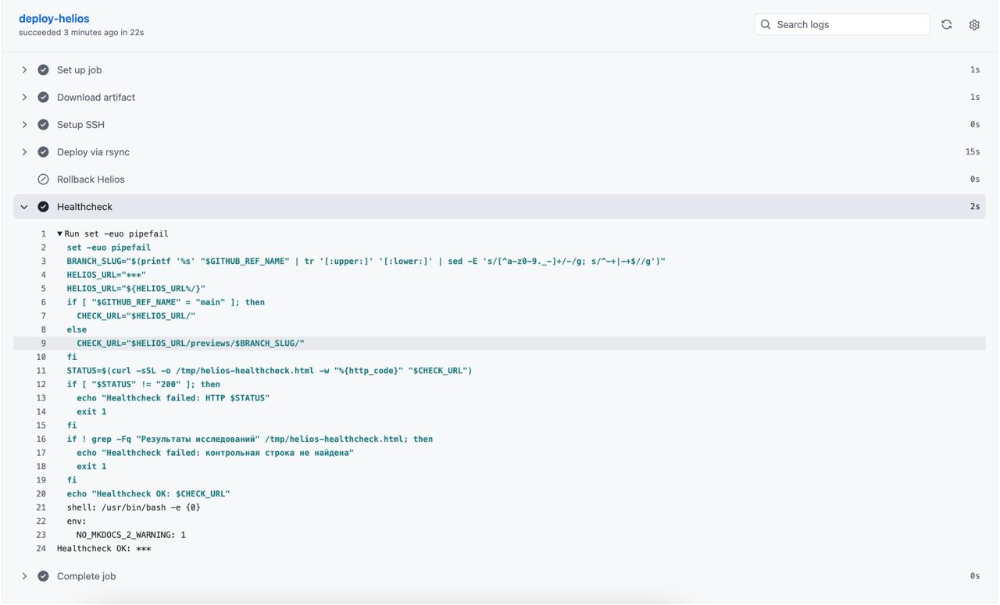
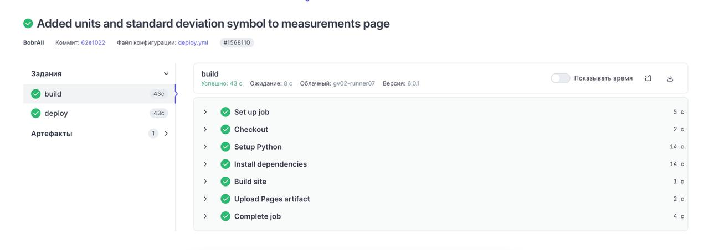
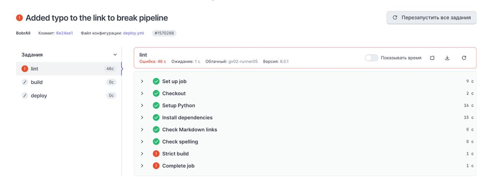
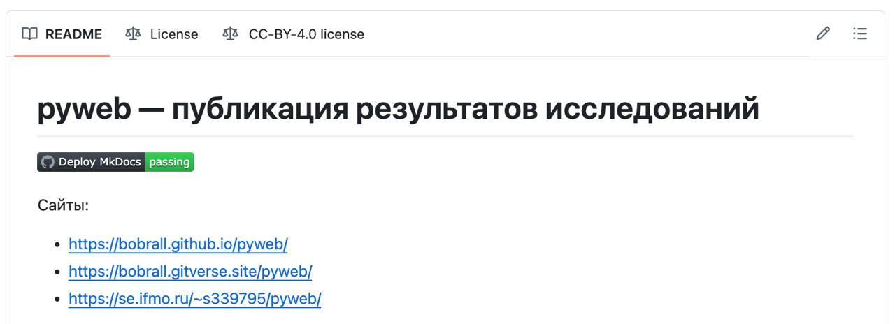

# P1. CI/CD-пайплайн на отечественном сервисе

## Реализация

Для публикации на отечественном сервисе выбран GitVerse Pages. Основной файл пайплайна находится в `.gitverse/workflows/deploy.yml`; для сопоставления используется аналогичный GitHub Actions workflow `.github/workflows/deploy.yml`.

GitVerse pipeline разделён на три job: `lint`, `build`, `deploy`.

| Job | Назначение | Входные данные | Артефакты и результат | Зависимость |
|---|---|---|---|---|
| `lint` | Проверка ссылок, орфографии и строгая сборка | Репозиторий, `requirements.txt`, `docs/`, `README.md` | Ошибка при битой ссылке, ошибке орфографии или warning в `mkdocs build --strict` | Нет |
| `build` | Повторяемая сборка сайта на чистом раннере | Исходники после успешного `lint`, pip cache | Pages artifact из каталога `site/` | `lint` |
| `deploy` | Публикация в GitVerse Pages | Pages artifact | Обновлённый сайт GitVerse Pages | `build`, только `main` |

Порядок выполнения:



## События запуска

| Событие | Ветка | Поведение |
|---|---|---|
| `push` | `main` | Выполняются `lint`, `build`, затем `deploy` в GitVerse Pages |
| `push` | Любая другая ветка | Выполняются `lint` и `build`; публикация пропускается условием `gitverse.ref == 'refs/heads/main'` |
| `workflow_dispatch` | Выбранная ветка | Запускается ручная проверка и сборка; публикация выполняется только для `main` |

Такое разделение снижает риск случайной публикации экспериментальной ветки: проверка воспроизводимости выполняется для всех изменений, но внешний сайт обновляется только из основной ветки.

## Воспроизводимость и кэш

В обоих пайплайнах фиксируется версия Python `3.13`, а зависимости ставятся из `requirements.txt`. Это позволяет поднять окружение на чистом runner без локальных файлов виртуального окружения.

| Проверка | Реализация |
|---|---|
| Версия Python | `actions/setup-python` с `python-version: '3.13'` |
| Версии пакетов | `requirements.txt` |
| Строгая сборка | `mkdocs build --strict` |
| Кэш зависимостей | `actions/cache/restore` для `~/.cache/pip` в GitVerse, `cache: pip` в GitHub Actions |
| Замеры времени | Страница `report/measurements.md`, workflow `measure.yml` |

## Секреты

Секреты хранятся в настройках платформы и не попадают в репозиторий. Для GitHub/Helios используются `HELIOS_SSH_KEY`, `HELIOS_KNOWN_HOSTS`, `HELIOS_USER`, `HELIOS_HOST`, `HELIOS_PORT`, `HELIOS_PATH`, `HELIOS_URL`. Для GitVerse Pages публикация выполняется встроенным механизмом Pages без добавления секретов в исходный код.

На скриншоте видно, что значения секретов в логе замаскированы и отображаются как `***`.



## Успешный запуск

Успешный запуск проходит все стадии: проверку, сборку и публикацию.



## Намеренно проваленный запуск

Для проверки strict-режима была добавлена намеренно битая ссылка `index7.md` в навигацию. Лог показывает, что MkDocs нашёл предупреждение:

```text
WARNING - A reference to 'index7.md' is included in the 'nav' configuration, which is not found in the documentation files.
Aborted with 1 warnings in strict mode!
Process completed with exit code 1.
```

Причина падения: в режиме `mkdocs build --strict` любое предупреждение считается ошибкой сборки. Это важно для CI: сайт не публикуется, если навигация указывает на несуществующую страницу.



## Badge статуса

В README добавлен badge GitHub Actions:



GitVerse Pages на момент выполнения работы не предоставляет штатный публичный endpoint для badge статуса pipeline, совместимый с Markdown-бейджами README. Поэтому для требования о badge использован GitHub Actions badge, а статус GitVerse подтверждается скриншотами pipeline в отчёте.

## Сравнение GitHub Actions и GitVerse

| Критерий | GitHub Actions | GitVerse pipeline |
|---|---|---|
| Файл workflow | `.github/workflows/deploy.yml` | `.gitverse/workflows/deploy.yml` |
| Синтаксис | GitHub Actions YAML | Близкий к GitHub Actions синтаксис |
| Триггеры | `push` по всем веткам, `workflow_dispatch` с параметрами rollback | `push` по всем веткам, `workflow_dispatch` |
| Проверка | В текущем GitHub workflow совмещена со сборкой `mkdocs build --strict` | Выделена отдельная стадия `lint`: ссылки, `codespell`, strict build |
| Сборка | `build` создаёт Pages artifact и отдельный artifact `site` для Helios | `build` создаёт Pages artifact для GitVerse Pages |
| Деплой основной ветки | `deploy-pages` публикует GitHub Pages только из `main` | `deploy-pages` публикует GitVerse Pages только при `gitverse.ref == 'refs/heads/main'` |
| Деплой дополнительных веток | Для GitHub Pages не выполняется; Helios публикует preview-подкаталоги | Не выполняется, остаётся только сборка |
| Кэш pip | Встроенный `cache: pip` в `setup-python` | Явный `actions/cache/restore` по ключу от `requirements.txt` |
| Секреты | Нужны для Helios deploy и healthcheck | Для Pages deploy секреты в файле workflow не нужны |
| Badge | Поддерживается стандартной ссылкой `/actions/workflows/.../badge.svg` | Штатный Markdown badge не поддержан, приложен скрин статуса |
| Rollback | Реализован для Helios через `workflow_dispatch` | Не реализован для GitVerse Pages |

Изменения при переносе с GitHub Actions на GitVerse оказались умеренными: структура job и большинство actions сохранились, но условия публикации пришлось записать через контекст `gitverse.ref`, а GitHub-специфичную часть Pages/Helios разделить с GitVerse Pages. Также badge нельзя перенести напрямую, потому что GitVerse не предоставляет совместимый badge URL.
