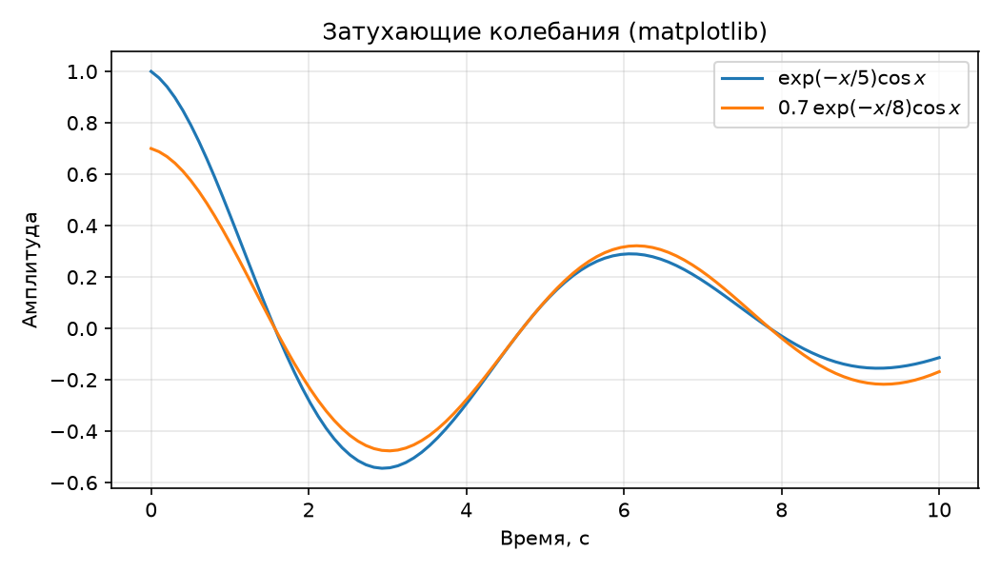

# Стресс-тест научного контента

Страница демонстрирует поддержку научных элементов генератором MkDocs (тема Material).

<p>Вариант этой же страницы на <a href="../sphinx/stress/index.html">Sphinx</a>.</p>

## Формула

Затухающие колебания описываются уравнением [формула (1)](#eq-damped):

<a id="eq-damped"></a>

$$
x(t) = A e^{-\gamma t}\cos(\omega t + \varphi) \tag{1}
$$

где $A$ — начальная амплитуда, $\gamma$ — коэффициент затухания, $\omega$ — круговая частота.

Ссылка на формулу: см. [формулу (1)](#eq-damped) выше.

## Таблица с объединёнными ячейками

<table class="stress-table">
<caption>Таблица 1. Результаты измерений времени сборки</caption>
<thead>
<tr><th>Генератор</th><th colspan="2">Время сборки, с</th><th>Размер, КБ</th></tr>
</thead>
<tbody>
<tr><td rowspan="2">MkDocs</td><td>холодная</td><td>3.2</td><td rowspan="2">1240</td></tr>
<tr><td>инкрементальная</td><td>1.1</td></tr>
<tr><td rowspan="2">Sphinx</td><td>холодная</td><td>4.8</td><td rowspan="2">1680</td></tr>
<tr><td>инкрементальная</td><td>1.9</td></tr>
<tr><td colspan="3"><strong>Итого</strong></td><td>2920</td></tr>
</tbody>
</table>

## Статический график

<figure>
  
  <figcaption>Рисунок 1. Затухающие колебания, построенные matplotlib</figcaption>
</figure>

## Интерактивный график

<iframe src="./plotly.html" width="100%" height="460" style="border:none;" loading="lazy"></iframe>

## Листинг кода

```python linenums="1"
def damping(t, gamma, omega):
    """Затухающие колебания."""
    import math
    return math.exp(-gamma * t) * math.cos(omega * t)

for t in range(0, 10):
    print(t, damping(t, 0.2, 2.0))
```

## Цитирование

MkDocs не поддерживает BibTeX без плагинов[^fn-bibtex], поэтому список литературы оформлен вручную: методика публикации описана в работе [1], а базовые возможности LaTeX — в [2]. Источник по matplotlib — [3].

1. Ивсов Д. С., Ковалёв М. А. Методы публикации результатов научных исследований в сети Интернет // Научно-технические ведомости СПбГПУ. 2021. Т. 27, № 3. С. 45–58.
2. Knuth D. E. The TeXbook. Reading, MA: Addison-Wesley, 1986.
3. Hunter J. D. Matplotlib: A 2D Graphics Environment // Computing in Science & Engineering. 2007. Vol. 9, No. 3. P. 90–95.

## Двухколоночный блок

<div style="display:flex; gap:24px; flex-wrap:wrap; align-items:flex-start;">
  <div style="flex:1 1 320px;">
    <p>Текст слева: статические генераторы позволяют собирать научно-технические сайты
    без серверной части. MkDocs с темой Material даёт готовую навигацию и поиск,
    а формулы и графики подключаются через расширения и встраиваемые фрагменты.</p>
  </div>
  <div style="flex:1 1 320px;">
    <figure>
      
      <figcaption>Иллюстрация справа</figcaption>
    </figure>
  </div>
</div>

## Сноски и перекрёстные ссылки

Сноска с дополнительным пояснением[^note-1]. Подробное описание методики измерений см. в разделе [«Методика»](../methodology.md).

[^note-1]: Сноска: все измерения выполнялись на одном раннере для сопоставимости результатов.

[^fn-bibtex]: Плагин типа `mkdocs-bibtex` требует установки и влияет на воспроизводимость сборки.
